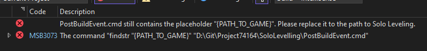

## SLA-Cheeto

### Caracteristicas 
- Sin Enfriamiento
- Modo Dios
- Damage Hack (Sólo funciona con ciertas armas)
- Enemigos Tontos (No te atacan)
- Tiempo de Misión 
- Escala de Tiempo
- Desbloqueador FPS
- Saltar película de introducción

### Construir
- ``git clone --recurse-submodules https://github.com/Taiga74164/SLA-Cheeto``
- ¿Es la primera vez que construyo y veo este error? \

- Sustituye **{PATH_TO_GAME}** por la ruta real de tu juego en PostBuildEvent.cmd.

- O antes de construir, puede crear inicialmente un PostBuildEvent.cmd con
``xcopy /f /y "{PROJECT_PATH}\x64\Release\SoloLevelling.dll" "{PATH_TO_GAME}\winhttp.dll*" ``
- Recuerde reemplazar los marcadores de posición con su propia ruta
