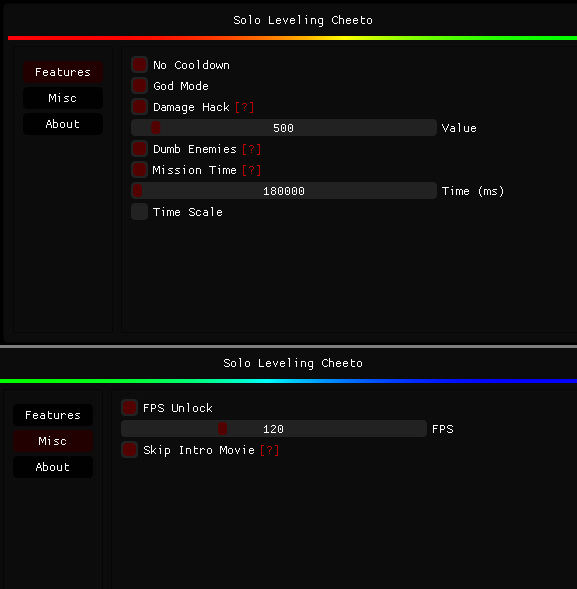

## SLA-Cheeto

## Disclaimer
This project is created and shared for educational purposes only. I do not condone or endorse the use of this project for any illegal activities or unethical behavior. The use of this project is solely at the user's discretion. I am not held responsible for any misuse of the information or code provided in this repository.

## Usage

### How to Run
1. Inject the DLL to the game with your preferred injector
2. Press insert to show the menu

## Features
- Instant Regen (Running can trigger this)
- No Cooldown
- No Cooldown Shadow (Enable only if you have shadow feature available)
- God Mode
- Kill Aura
- Damage Hack
- Mob Vacuum
- Dumb Enemies (They don't attack you)
- Mission Time (Enable this before starting a mission)
- Time Scale
- FPS Unlocker
- Fov Changer
- Skip Intro Movie (Loads the game faster)
## Screenshot

## Building
1. Clone the repository: `git clone --recurse-submodules https://github.com/Taiga74164/SLA-Cheeto`.
2. Build with your preferred IDE.
3. Output will be in bin/

## Contributing
1. Fork the repo (<https://github.com/Taiga74164/SLA-Cheeto/fork>).
2. Create your feature branch.
3. Commit your changes.
4. Push your changes to the branch.
5. Create a new pull request.
